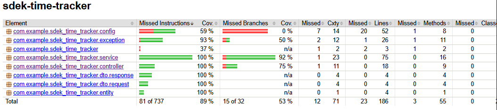
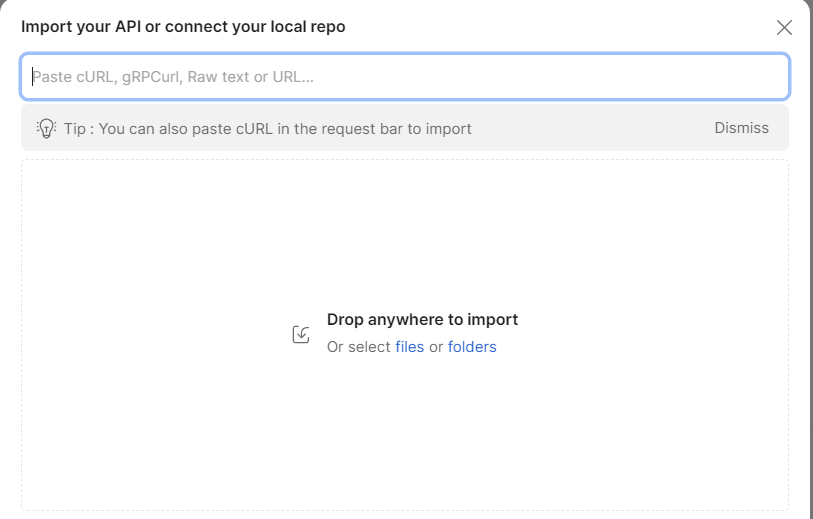

# Task Time Tracker API 
Backend REST API для учета рабочего времени сотрудников по определенной задаче
Реализован в рамках тестового задания на Java + SpringBoot

---

## Контекст 

Сервис предназначается для:

- управления задачами
- учета времени сотрудников
- фиксации потраченного времени на задачу
- получения информации о затраченном времени сотрудником на задачу

Реализованы следующие возможности:

### Task 
- Создание задачи
- Получение задачи по id
- Изменение статуса задачи(NEW / IN_PROGRESS / DONE)

### TimeRecord
- Создание записи о затраченном времени
- Получение записей сотрудника за период

### Дополнительно
- JWT аутентификация(Bearer Token)
- Валидация входных данных(Bean Validation)
- Глобальная обработка ошибок (@RestControllerAdvice)
- Swagger (SpringDoc OpenApi)
- Покрытие тестами (unit, integration, controller)

---

## Стек проекта
- Java 17
- Spring Boot 3
- Maven
- PostgreSQL (Docker)
- MyBatis
- Lombok
- Swagger (SpringDoc OpenAPI)
- JUnit 5
- Mockito
- Testcontainers
- JWT (Bearer Authentication)

---

## Запуск базы данных
docker compose up -d
# Параметры:
- database: task_tracker
- user: postgres
- password: postgres
- port: 5432

---

## Запуск приложения
- mvn clean install
- mvn spring-boot:run или запуск SdekTimeTrackerApplication в IDE

---

## Swagger
http://localhost:8080/swagger-ui/index.html

## Аутентификация
Получение токена: POST /api/auth/login
Содержимое запроса:

{
"username": "admin",
"password": "admin"
}

# Использование:

Нажатие в SwaggerUI кнопки Authorize и вставка самого токена в поле 'Value'

---

## Тестирование
- mvn test

Реализованы:
- unit тесты
- интеграционные тесты(Testcontainers + PostgreSQL)
- controller тесты(MockMVC)

Для анализа покрытия используется плагин JaCoCo(примерно 89 процентов покрытия):

После mvn clean test отчет доступен: /target/site/index.html

### Примеры и проверка

Проверку можно осуществить в Swagger вручную или использовать коллекцию с примерами из Postman

## Postman коллекция

Коллекция находится в корне проекта: "Time Tracker API.postman_collection.json"
Импорт:  File -> Import -> загружаем файл в Postman

