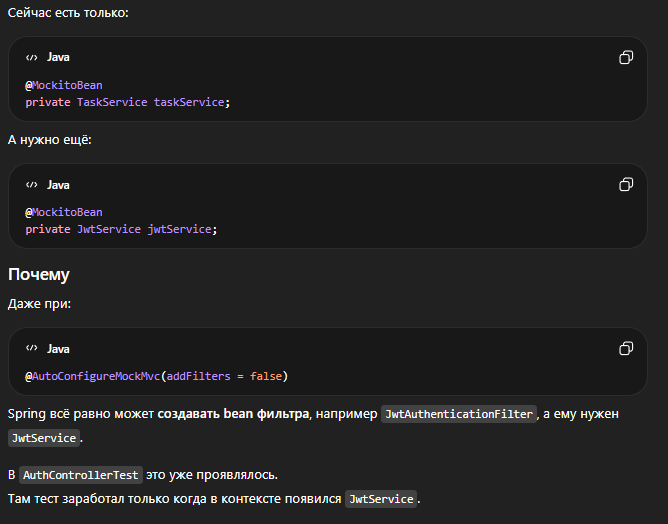
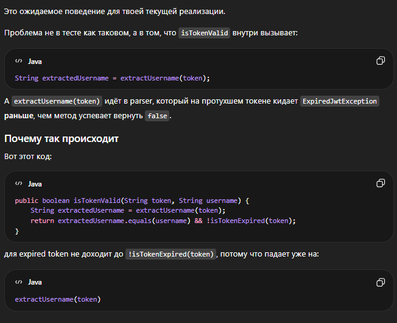

## Использование ИИ

При выполнении тестового задания использовался ChatGPT как вспомогательный инструмент.

Все архитектурные и кодовые решения были проанализированы лично и адаптированы вручную

### Основные сценарии использования

- Обдумывание структуры проекта и архитектуры слоев
- Настройка Spring Security и JWT-аутентификации
- Написание и отладка тестов(MockMvc, TestContainers)
- Помощь в оформлении документации

### Пример: проблема с загрузкой ApplicationContext в тестах

При написании controller-тестов возникла ошибка: "Failed to load Application Context"

Проблема была связана с тем, что Spring Security и зависимости были неверно замоканы в @WebMVCTest

С помощью ChatGPT было найдено решение:
- отключение security через excludeAutoConfiguration
- добавление необходимых зависимостей через @MockitoBean

В результате controller-тесты были успешно изолированы и начали стабильно выполняться

### Пример: ошибка ExpiredJwtException

В процессе тестирования возникла ошибка ExpiredJwtException при проверке токена.

Была выявлена проблема, что при истечении срока действия токена библиотека выбрасывает исключение,
а не просто возвращает false

С помощью ChatGPT было найдено решение:
- добавлен try-catch в метод isTokenValid
- в результате добавления все невалидные и просроченные токены корректно отрабатываются

